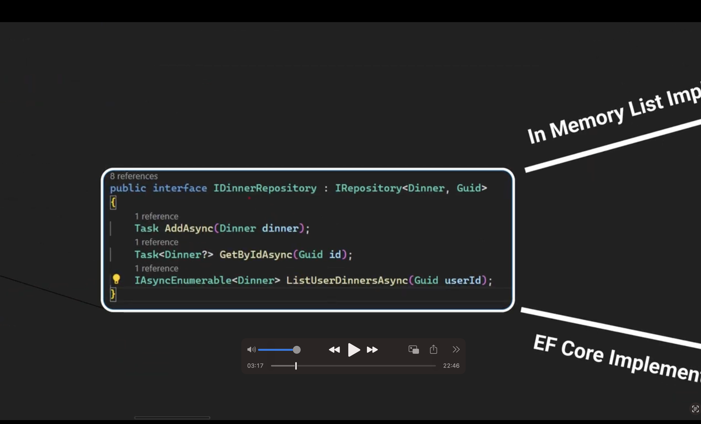
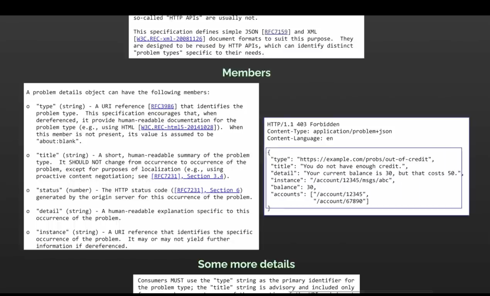

##### Clean ARCHITECTURE IN DOTNET CORE
- The architecture pattern you might be thinking of is likely "Clean Architecture" or sometimes referred to as "Onion Architecture."

- In the context of a .NET web API, the Clean Architecture approach would typically involve these layers:

- Core Domain Layer: This layer contains the domain entities and business logic. It has no dependencies on any other layer.
- Application: This layer contains interfaces that are implemented by the Infrastructure layer. It depends on the Domain layer.
- Infrastructure: This layer contains classes for accessing external resources such as file systems, web services, SMTP, and so on. These classes should implement the interfaces defined in the Application layer. It depends on both the Domain and Application layers.
- Presentation: This layer contains HTTP controllers, models, and other presentation-specific items. These items should implement the interfaces defined in the Application layer. It depends only on the Application layer.

Other names for Clean Architecture include Hexagonal Architecture and Ports and Adapters, Onion Architecture.


##### Create a new solution (i.e a blank solution)
- dotnet new sln -o BuberDinner

##### Create a new project 
cd BuberDinner
dotnet new webapi -o BuberDinner.Api

##### Create a class library project contracts
cd BuberDinner 
dotnet new classlib -o BuberDinner.Contracts

##### Create infrastructure project
cd BuberDinner
dotnet new classlib -o BuberDinner.Infrastructure

##### Create application project
cd BuberDinner
dotnet new classlib -o BuberDinner.Application

##### Create domain project
cd BuberDinner
dotnet new classlib -o BuberDinner.Domain

##### Build the solution
dotnet build
You will get : Unable to find a project to restore!

##### Add the projects to the solution (recursively)
dotnet sln add BuberDinner.Api/BuberDinner.Api.csproj
dotnet sln add BuberDinner.Contracts/BuberDinner.Contracts.csproj
dotnet sln add BuberDinner.Infrastructure/BuberDinner.Infrastructure.csproj
dotnet sln add BuberDinner.Application/BuberDinner.Application.csproj
dotnet sln add BuberDinner.Domain/BuberDinner.Domain.csproj

##### The solution should now be ready to build
dotnet build


##### Add dependencies to the projects
The api projects needs to know about the Contracts, Application and Infrastructure projects. The Infrastructure project needs to know about the Contracts project. The Application project needs to know about the Contracts and Domain projects. The Domain project needs to know about the Contracts project.
- dotnet add BuberDinner.Api/BuberDinner.Api.csproj reference BuberDinner.Contracts/BuberDinner.Contracts.csproj
- dotnet add BuberDinner.Api/BuberDinner.Api.csproj reference BuberDinner.Application/BuberDinner.Application.csproj

##### We want the infrastructure project to have dependencies on the Application project
- dotnet add BuberDinner.Infrastructure/BuberDinner.Infrastructure.csproj reference BuberDinner.Application/BuberDinner.Application.csproj

##### We want the Application project to have dependencies on the Domain project
- dotnet add BuberDinner.Application/BuberDinner.Application.csproj reference BuberDinner.Domain/BuberDinner.Domain.csproj

##### We want the Api project to have dependencies on the Infrastructure project
- dotnet add BuberDinner.Api/BuberDinner.Api.csproj reference BuberDinner.Infrastructure/BuberDinner.Infrastructure.csproj


##### Build and run the solution
- dotnet build
- dotnet run --project BuberDinner.Api/BuberDinner.Api.csproj
- dotnet watch run --project BuberDinner.Api/BuberDinner.Api.csproj

##### Download nugget reverse package search in visual studio code

dotnet add BuberDinner.Application/BuberDinner.Application.csproj package Microsoft.Extensions.DependencyInjection.Abstractions

To use e.g
```csharp
using BuberDinner.Application.Services.Authentication;
using Microsoft.Extensions.DependencyInjection;

namespace BuberDinner.Application;

public static class DependencyInjection{
    public static IServiceCollection AddApplication(this IServiceCollection services){
    services.AddScoped<IAuthenticationService, AuthenticationService>();
        return services;
    }
}
```

Highlight the IServiceCollection and pres Command Shift P and select nugget reverse package search and then select Microsoft.Extensions.DependencyInjection.Abstractions

##### Add the following to the Application layer
- dotnet add BuberDinner.Application/BuberDinner.Application.csproj package Microsoft.Extensions.DependencyInjection.Abstractions


---

##### Part 2: 


In the Infrastructure project, install the following packages:
- dotnet add BuberDinner.Infrastructure/BuberDinner.Infrastructure.csproj package System.IdentityModel.Tokens.Jwt


---

##### To decode the token in Visual Studio Code install:
- jwt-decode

To use, select the token and press Command Shift P and select jwt-decode
or just paste the token anywhere e.g in the .http file

command + shift + p and select jwt-decode, then hover over the token 

---

##### Instal vs brower

Command + Shift + P and select vs browser
You can use a browser within your vscode


##### Install the following packages in the Infrastructure project
- dotnet add BuberDinner.Infrastructure/BuberDinner.Infrastructure.csproj package Microsoft.Extensions.Configuration
- dotnet add BuberDinner.Infrastructure/BuberDinner.Infrastructure.csproj package Microsoft.Extensions.Options.ConfigurationExtensions


##### dotnet user-secrets
- dotnet user-secrets init --project BuberDinner.Api/BuberDinner.Api.csproj


##### set the secret : dotnet user-secrets set --project BuberDinner.Api/BuberDinner.Api.csproj YourSecretKey YourSecretValue

- dotnet user-secrets set --project BuberDinner.Api/BuberDinner.Api.csproj "JwtSettings:Secret" "super-secret-key-super-secret-key"

##### get the secret
- dotnet user-secrets list --project BuberDinner.Api/BuberDinner.Api.csproj


##### Repository Pattern
The repository pattern is a design pattern that abstracts the data access logic in your application away from the rest of the application. It provides a way to perform CRUD operations on data without having to know or worry about where the data is coming from or how it is being stored. This allows you to easily swap out the data access logic for a different implementation without having to change the rest of your application.





##### Repository pattern with no persistence
```csharp
using BuberDinner.Application.Common.Interfaces.Persistence;
using BuberDinner.Domain.Entities;

namespace BuberDinner.Infrastructure.Persistence;
public class UserRepository : IUserRepository
{
    private readonly List<User> _users = new();
    public void Add(User user)
    {
        _users.Add(user);
    }

    public User? GetUserByEmail(string email)
    {
       return  _users.SingleOrDefault(u => u.Email == email);

    }
}
```

##### Run the application
- dotnet run --project BuberDinner.Api/BuberDinner.Api.csproj


###### Error Handling
- Global Error Handling
Create a new folder called Middleware/ErrorHandlingMiddleware.cs
```csharp
using System.Net;
using System.Text.Json;

namespace BuberDinner.Api.Middleware;

public class ErrorHandlingMiddleware{
    private readonly RequestDelegate _next;

    public ErrorHandlingMiddleware(RequestDelegate next)
    {
        _next = next;
    }

    public async Task Invoke(HttpContext context)
    {
        try
        {
            await _next(context);
        }
        catch (Exception ex)
        {
            await HandleExceptionAsync(context, ex);
        }
    }

    private static Task HandleExceptionAsync(HttpContext context, Exception exception)
    {
        var code = HttpStatusCode.InternalServerError; // 500 if unexpected

    //    var result = JsonSerializer.Serialize(new { error = "An error occured while processing your request" });
        var result = JsonSerializer.Serialize(new { error = exception.Message });
        context.Response.ContentType = "application/json";
        context.Response.StatusCode = (int)code;
        return context.Response.WriteAsync(result);
    }

}
```

And then in the Program.cs file, add the following:
```csharp
using BuberDinner.Api.Middleware;
using BuberDinner.Application;
using BuberDinner.Infrastructure;

var builder = WebApplication.CreateBuilder(args);
{
    builder.Services
    .AddApplication()
    .AddInfrastructure(builder.Configuration);
    builder.Services.AddControllers();
}

var app = builder.Build();
{
    app.UseMiddleware<ErrorHandlingMiddleware>(); // Add this line
    app.UseHttpsRedirection();
    app.MapControllers();
    app.Run();

}
```


- Error Filtering
Create a new folder called Filters/ErrorHandlingFilter.cs
```csharp
using Microsoft.AspNetCore.Mvc;
using Microsoft.AspNetCore.Mvc.Filters;

namespace BuberDinner.Api.Filters {
    public class ErrorHandlingFilterAttribute : ExceptionFilterAttribute
    {
        public override void OnException(ExceptionContext context)
        {
            var exception = context.Exception;

            context.Result = new ObjectResult(exception.Message)
            {
                StatusCode = 500
            };

            context.ExceptionHandled = true;
        }
    }
}
```

And in the controller, add the following:
```csharp
using BuberDinner.Api.Filters;
using BuberDinner.Application.Services.Authentication;
using BuberDinner.Contracts.Authentication;
using Microsoft.AspNetCore.Mvc;

namespace BuberDinner.Api.Controllers;

[ApiController]
[Route("auth")] // you can use [Route("api/[controller]")] instead
[ErrorHandlingFilter] // Add this line
public class AuthenticationController: ControllerBase
{
    private readonly IAuthenticationService _authenticationService;

    public AuthenticationController(IAuthenticationService authenticationService)
    {
        _authenticationService = authenticationService;
    }

    [HttpPost("register")]
    public IActionResult Register([FromBody] RegisterRequest request)
    {
        var authresult = _authenticationService.Register(
            request.FirstName,
            request.LastName,
            request.Email,
            request.Password);

        var response = new AuthenticationResponse(
            authresult.User.Id,
            authresult.User.Email,
            authresult.User.FirstName,
            authresult.User.LastName,
            authresult.Token
        );
        return Ok(response);
    }

    [HttpPost("login")]
    public IActionResult Login([FromBody] LoginRequest request)
    {
        var authresult = _authenticationService.Login(
            request.Email,
            request.Password);

        var response = new AuthenticationResponse(
            authresult.User.Id,
            authresult.User.Email,
            authresult.User.FirstName,
            authresult.User.LastName,
            authresult.Token
        );
        return Ok(response);
    }
}
```

If you dont want to specify it on all Controllers, you can use it on the Program.cs file
```csharp
using BuberDinner.Api.Filters;
using BuberDinner.Application;
using BuberDinner.Infrastructure;

var builder = WebApplication.CreateBuilder(args);
{
    builder.Services
    .AddApplication()
    .AddInfrastructure(builder.Configuration);
    builder.Services.AddControllers(options => options.Filters.Add<ErrorHandlingFilterAttribute>()); // Add this line
}

var app = builder.Build();
{
    // app.UseMiddleware<ErrorHandlingMiddleware>();
    app.UseHttpsRedirection();
    app.MapControllers();
    app.Run();

}





- Using Problem Details with ErrorFilter
In ErrorHandlingFilter.cs, add the following:
```csharp
using System.Net;
using Microsoft.AspNetCore.Mvc;
using Microsoft.AspNetCore.Mvc.Filters;

namespace BuberDinner.Api.Filters {
    public class ErrorHandlingFilterAttribute : ExceptionFilterAttribute
    {
        public override void OnException(ExceptionContext context)
        {
            var exception = context.Exception;
            var problemDetails = new ProblemDetails
            {
                Type = "https://tools.ietf.org/html/rfc7231#section-6.6.1",
                Title = exception.Message,
                Instance = context.HttpContext.Request.Path, 
                Status = (int)HttpStatusCode.InternalServerError,
                Detail = exception.StackTrace
            };
            context.Result = new ObjectResult(problemDetails);
           
            context.ExceptionHandled = true;
        }
    }
}
```

- The fourth method
In Program.cs
```csharp
using BuberDinner.Api.Filters;
using BuberDinner.Application;
using BuberDinner.Infrastructure;

var builder = WebApplication.CreateBuilder(args);
{
    builder.Services
    .AddApplication()
    .AddInfrastructure(builder.Configuration);
    // builder.Services.AddControllers(options => options.Filters.Add<ErrorHandlingFilterAttribute>());
    builder.Services.AddControllers();
}

var app = builder.Build();
{
    // app.UseMiddleware<ErrorHandlingMiddleware>();
    app.UseExceptionHandler("/error");
    app.UseHttpsRedirection();
    app.MapControllers();
    app.Run();

}
```

In your Controller folder, Add a new Controller called ErrorsController
```csharp
using Microsoft.AspNetCore.Mvc;

namespace BuberDinner.Api.Controllers;

public class ErrorsController : ControllerBase
{
   [Route("/error")]
    public IActionResult Error(){
        return Problem();
    }
}
```

With the above without any settings, you get the below when an error occur
```json
HTTP/1.1 500 Internal Server Error
Connection: close
Content-Type: application/problem+json; charset=utf-8
Date: Sat, 12 Aug 2023 13:07:05 GMT
Server: Kestrel
Cache-Control: no-cache,no-store
Expires: -1
Pragma: no-cache
Transfer-Encoding: chunked

{
  "type": "https://tools.ietf.org/html/rfc7231#section-6.6.1",
  "title": "An error occurred while processing your request.",
  "status": 500,
  "traceId": "00-458db87252974e22e95f004f5a955dd0-bf2e3411800050f3-00"
}
```

##### Be specific with the error
```csharp
using Microsoft.AspNetCore.Diagnostics;
using Microsoft.AspNetCore.Mvc;

namespace BuberDinner.Api.Controllers;

public class ErrorsController : ControllerBase
{
   [Route("/error")]
    public IActionResult Error(){
        Exception? exception = HttpContext.Features.Get<IExceptionHandlerFeature>()?.Error;
        return Problem(
            statusCode: 400,
            title: exception?.Message
        );
    }
} 
```

##### To be more specific with the error
Create a new Folder called Errors and a file called BuberDinnerProblemDetailsFactory.cs
```csharp
using System;
using System.Diagnostics;
using Microsoft.AspNetCore.Http;
using Microsoft.AspNetCore.Mvc;
using Microsoft.AspNetCore.Mvc.Infrastructure;
using Microsoft.AspNetCore.Mvc.ModelBinding;
using Microsoft.Extensions.Options;

namespace BuberDinner.Api.Errors
{
    public class BuberDinnerProblemDetailsFactory : ProblemDetailsFactory
    {
        private readonly ApiBehaviorOptions _options;

        public BuberDinnerProblemDetailsFactory(IOptions<ApiBehaviorOptions> options)
        {
            _options = options.Value ?? throw new ArgumentNullException(nameof(options));
        }

        public override ProblemDetails CreateProblemDetails(
            HttpContext httpContext,
            int? statusCode = null,
            string? title = null,
            string? type = null,
            string? detail = null,
            string? instance = null)
        {
            var problemDetails = new ProblemDetails
            {
                Status = statusCode,
                Title = title,
                Type = type,
                Detail = detail,
                Instance = instance
            };

            ApplyProblemDetailsDefaults(httpContext, problemDetails, statusCode.GetValueOrDefault());

            return problemDetails;
        }

        public override ValidationProblemDetails CreateValidationProblemDetails(
            HttpContext httpContext,
            ModelStateDictionary modelStateDictionary,
            int? statusCode = null,
            string? title = null,
            string? type = null,
            string? detail = null,
            string? instance = null)
        {
            var validationProblemDetails = new ValidationProblemDetails(modelStateDictionary)
            {
                Status = statusCode,
                Title = title,
                Type = type,
                Detail = detail,
                Instance = instance
            };

            ApplyProblemDetailsDefaults(httpContext, validationProblemDetails, statusCode.GetValueOrDefault());

            return validationProblemDetails;
        }

        private void ApplyProblemDetailsDefaults(
            HttpContext httpContext,
            ProblemDetails problemDetails,
            int statusCode)
        {
            problemDetails.Status ??= statusCode;

            if (problemDetails.Instance == null)
            {
                problemDetails.Instance = httpContext.Request.Path;
            }

            var traceId = Activity.Current?.Id ?? httpContext?.TraceIdentifier;
            if (traceId != null)
            {
                problemDetails.Extensions["traceId"] = traceId;
            }

            // add custom extensions
            problemDetails.Extensions.Add("customProperty", "customValue");
        }
    }
}
```

In the Program.cs file, add the following:
```csharp
using BuberDinner.Api.Errors;
using BuberDinner.Api.Filters;
using BuberDinner.Application;
using BuberDinner.Infrastructure;
using Microsoft.AspNetCore.Mvc.Infrastructure;

var builder = WebApplication.CreateBuilder(args);
{
    builder.Services
    .AddApplication()
    .AddInfrastructure(builder.Configuration);
    // builder.Services.AddControllers(options => options.Filters.Add<ErrorHandlingFilterAttribute>());
    builder.Services.AddControllers();

    builder.Services.AddSingleton<ProblemDetailsFactory, BuberDinnerProblemDetailsFactory>(); // Add this line
}

var app = builder.Build();
{
    // app.UseMiddleware<ErrorHandlingMiddleware>();
    app.UseExceptionHandler("/error");
    app.UseHttpsRedirection();
    app.MapControllers();
    app.Run();

}
```


##### Run the application using the watch
- dotnet watch --project BuberDinner.Api/BuberDinner.Api.csproj
if you don't want the watch to launch the browser go to Properties folder in the Api Project and change the launchBrowser under the Api setting to false
```csharp
{
  "$schema": "https://json.schemastore.org/launchsettings.json",
  "iisSettings": {
    "windowsAuthentication": false,
    "anonymousAuthentication": true,
    "iisExpress": {
      "applicationUrl": "http://localhost:53216",
      "sslPort": 44358
    }
  },
  "profiles": {
    "http": {
      "commandName": "Project",
      "dotnetRunMessages": true,
      "launchBrowser": false, // Change here <--------
      "launchUrl": "swagger",
      "applicationUrl": "http://localhost:5116",
      "environmentVariables": {
        "ASPNETCORE_ENVIRONMENT": "Development"
      }
    },
    "https": {
      "commandName": "Project",
      "dotnetRunMessages": true,
      "launchBrowser": true,
      "launchUrl": "swagger",
      "applicationUrl": "https://localhost:7120;http://localhost:5116",
      "environmentVariables": {
        "ASPNETCORE_ENVIRONMENT": "Development"
      }
    },
    "IIS Express": {
      "commandName": "IISExpress",
      "launchBrowser": true,
      "launchUrl": "swagger",
      "environmentVariables": {
        "ASPNETCORE_ENVIRONMENT": "Development"
      }
    }
  }
}

```


---

##### Catching Error Part 2
In the Api project, create a new folder called Common/Errors and a file called BuberDinnerProblemDetailsFactory.cs
```csharp
using System;
using System.Diagnostics;
using Microsoft.AspNetCore.Mvc;
using Microsoft.AspNetCore.Mvc.Infrastructure;
using Microsoft.AspNetCore.Mvc.ModelBinding;
using Microsoft.Extensions.Options;

namespace BuberDinner.Api.Errors
{
    public class BuberDinnerProblemDetailsFactory : ProblemDetailsFactory
    {
        private readonly ApiBehaviorOptions _options;

        public BuberDinnerProblemDetailsFactory(IOptions<ApiBehaviorOptions> options)
        {
             _options = options?.Value ?? throw new ArgumentNullException(nameof(options));
        }

        public override ProblemDetails CreateProblemDetails(
        HttpContext httpContext,
        int? statusCode = null,
        string? title = null,
        string? type = null,
        string? detail = null,
        string? instance = null)
    {
        statusCode ??= 500;

        var problemDetails = new ProblemDetails
        {
            Status = statusCode,
            Title = title,
            Type = type,
            Detail = detail,
            Instance = instance
        };

        ApplyProblemDetailsDefaults(httpContext, problemDetails, statusCode.Value);

        return problemDetails;
    }

         public override ValidationProblemDetails CreateValidationProblemDetails(
        HttpContext httpContext,
        ModelStateDictionary modelStateDictionary,
        int? statusCode = null,
        string? title = null,
        string? type = null,
        string? detail = null,
        string? instance = null)
    {
        if (modelStateDictionary == null)
        {
            throw new ArgumentNullException(nameof(modelStateDictionary));
        }

        statusCode ??= 400;

        var problemDetails = new ValidationProblemDetails(modelStateDictionary)
        {
            Status = statusCode,
            Type = type,
            Detail = detail,
            Instance = instance,
        };

        if (title != null)
        {
            // For validation problem details, don't overwrite the default title with null.
            problemDetails.Title = title;
        }

        ApplyProblemDetailsDefaults(httpContext, problemDetails, statusCode.Value);

        return problemDetails;
    }

     private void ApplyProblemDetailsDefaults(HttpContext httpContext, ProblemDetails problemDetails, int statusCode)
    {
        problemDetails.Status ??= statusCode;

        if (_options.ClientErrorMapping.TryGetValue(statusCode, out var clientErrorData))
        {
            problemDetails.Title ??= clientErrorData.Title;
            problemDetails.Type ??= clientErrorData.Link;
        }

        var traceId = Activity.Current?.Id ?? httpContext?.TraceIdentifier;
        if (traceId != null)
        {
            problemDetails.Extensions["traceId"] = traceId;
        }

    }


    }
}
```

In Controllers/ErrorsController.cs
```csharp
using BuberDinner.Application.Common.Errors;
using Microsoft.AspNetCore.Diagnostics;
using Microsoft.AspNetCore.Mvc;

namespace BuberDinner.Api.Controllers;

public class ErrorsController : ControllerBase
{
   [Route("/error")]
    public IActionResult Error(){
        Exception? exception = HttpContext.Features.Get<IExceptionHandlerFeature>()?.Error;
      
        var (statusCode, message) = exception switch
        {
            IServiceException serviceException => ((int)serviceException.StatusCode, serviceException.ErrorMessage),
            _ => (StatusCodes.Status500InternalServerError, "An unexpected error occured")
        };
        return Problem(
            statusCode: statusCode,
            title: message
        );

    }
} 
```

In Application/Common/Errors/IServiceException.cs
```csharp
using System.Net;

namespace BuberDinner.Application.Common.Errors;

public class DuplicateEmailException : Exception, IServiceException
{
    public HttpStatusCode StatusCode => HttpStatusCode.Conflict;
    public string ErrorMessage => "User with this email already exists";
}

```

In Program.cs
```csharp
using BuberDinner.Api.Errors;
using BuberDinner.Application;
using BuberDinner.Infrastructure;
using Microsoft.AspNetCore.Mvc.Infrastructure;

var builder = WebApplication.CreateBuilder(args);
{
    builder.Services
    .AddApplication()
    .AddInfrastructure(builder.Configuration);
    builder.Services.AddControllers();

    builder.Services.AddSingleton<ProblemDetailsFactory, BuberDinnerProblemDetailsFactory>();
}

var app = builder.Build();
{
    app.UseExceptionHandler("/error");
    app.UseHttpsRedirection();
    app.MapControllers();
    app.Run();

}

```

In Application.Services.Authentication/AuthenticationService.cs
```csharp
using BuberDinner.Application.Common.Errors;
using BuberDinner.Application.Common.Interfaces.Authentication;
using BuberDinner.Application.Common.Interfaces.Persistence;
using BuberDinner.Domain.Entities;

namespace BuberDinner.Application.Services.Authentication;

public class AuthenticationService : IAuthenticationService
{
    private readonly IJwtTokenGenerator _jwtTokenGenerator;
    private readonly IUserRepository _userRepository;

    public AuthenticationService(IJwtTokenGenerator jwtTokenGenerator, IUserRepository userRepository)
    {
        _jwtTokenGenerator = jwtTokenGenerator;
        _userRepository = userRepository;
    }

    public AuthenticationResult Login(string Email, string Password)
    {

        // 1. Check if user exists
        if(_userRepository.GetUserByEmail(Email) is not User user){
            throw new Exception("User does not exist");
        }

        // 2. Check if password is correct
        if(user.Password != Password){
            throw new Exception("Password is incorrect");
        }
      

        // 3. Create jwt token
        var token = _jwtTokenGenerator.GenerateToken(user);
        
        return new AuthenticationResult(
            user,
            token);
    }

    public AuthenticationResult Register(string FirstName, string LastName, string Email, string Password)
    {
        //1. Vakidate if user does not exist
        if(_userRepository.GetUserByEmail(Email) is not null){
            throw new DuplicateEmailException(); // Custom Exception
        }

        //2. create user (generate unique id) & persist to db
        var user = new User
        {
            FirstName = FirstName,
            LastName = LastName,
            Email = Email,
            Password = Password
        };

        _userRepository.Add(user);
        // 3. create jwt token
        var token = _jwtTokenGenerator.GenerateToken(user);

        return new AuthenticationResult(
           user,
            token);
    }
}
```


---

###### Second Approach of handling exceptions using oneof
Add the package to the Application project
- dotnet add BuberDinner.Application/BuberDinner.Application.csproj package oneof

After installing, in the Application project, Common/Errors create a new file called DuplicateEmailError.cs
```csharp
namespace BuberDinner.Application.Common.Errors;

public record struct DuplicateEmailError();
```

Then in the IAuthenticationService.cs file, change the return type of the Register method to oneof
```csharp
using BuberDinner.Application.Common.Errors;
using OneOf;

namespace BuberDinner.Application.Services.Authentication;

public interface IAuthenticationService
{
   OneOf<AuthenticationResult, DuplicateEmailError> Register(string FirstName, string LastName, string Email, string Password);
    AuthenticationResult Login(string Email, string Password);
}
```

Then in the AuthenticationService.cs file, change the return type of the Register method to oneof
```csharp
using BuberDinner.Application.Common.Errors;
using BuberDinner.Application.Common.Interfaces.Authentication;
using BuberDinner.Application.Common.Interfaces.Persistence;
using BuberDinner.Domain.Entities;
using OneOf;

namespace BuberDinner.Application.Services.Authentication;

public class AuthenticationService : IAuthenticationService
{
    private readonly IJwtTokenGenerator _jwtTokenGenerator;
    private readonly IUserRepository _userRepository;

    public AuthenticationService(IJwtTokenGenerator jwtTokenGenerator, IUserRepository userRepository)
    {
        _jwtTokenGenerator = jwtTokenGenerator;
        _userRepository = userRepository;
    }

    public AuthenticationResult Login(string Email, string Password)
    {

        // 1. Check if user exists
        if(_userRepository.GetUserByEmail(Email) is not User user){
            throw new Exception("User does not exist");
        }

        // 2. Check if password is correct
        if(user.Password != Password){
            throw new Exception("Password is incorrect");
        }
      

        // 3. Create jwt token
        var token = _jwtTokenGenerator.GenerateToken(user);
        
        return new AuthenticationResult(
            user,
            token);
    }

    public OneOf<AuthenticationResult, DuplicateEmailError> Register(string FirstName, string LastName, string Email, string Password) // Change here 
    {
        //1. Vakidate if user does not exist
        if(_userRepository.GetUserByEmail(Email) is not null){
            return new DuplicateEmailError(); // Custom Exception
        }

        //2. create user (generate unique id) & persist to db
        var user = new User
        {
            FirstName = FirstName,
            LastName = LastName,
            Email = Email,
            Password = Password
        };

        _userRepository.Add(user);
        // 3. create jwt token
        var token = _jwtTokenGenerator.GenerateToken(user);

        return new AuthenticationResult(
           user,
            token);
    }
}
```

Then in the ErrorsController.cs file, change the return type of the Error method to oneof
```csharp
using BuberDinner.Application.Common.Errors;
using Microsoft.AspNetCore.Diagnostics;
using Microsoft.AspNetCore.Mvc;

namespace BuberDinner.Api.Controllers;

public class ErrorsController : ControllerBase
{
   [Route("/error")]
    public IActionResult Error(){
        Exception? exception = HttpContext.Features.Get<IExceptionHandlerFeature>()?.Error;
      
        var (statusCode, message) = exception switch
        {
            IServiceException serviceException => ((int)serviceException.StatusCode, serviceException.ErrorMessage),
            _ => (StatusCodes.Status500InternalServerError, "An unexpected error occured")
        };
        return Problem(
            statusCode: statusCode,
            title: message
        );

    }
} 
```

Then in AuthController.cs
```csharp
using BuberDinner.Application.Common.Errors;
using BuberDinner.Application.Services.Authentication;
using BuberDinner.Contracts.Authentication;
using Microsoft.AspNetCore.Mvc;
using OneOf;

namespace BuberDinner.Api.Controllers;

[ApiController]
[Route("auth")] // you can use [Route("api/[controller]")] instead
public class AuthenticationController: ControllerBase
{
    private readonly IAuthenticationService _authenticationService;

    public AuthenticationController(IAuthenticationService authenticationService)
    {
        _authenticationService = authenticationService;
    }

    [HttpPost("register")]
    public IActionResult Register([FromBody] RegisterRequest request)
    {
        OneOf<AuthenticationResult, DuplicateEmailError> registerResult = _authenticationService.Register(
            request.FirstName,
            request.LastName,
            request.Email,
            request.Password);

        // if(registerResult.IsT0)
        // {
        //     var authResult = registerResult.AsT0;
        //     AuthenticationResponse response = MapAuthResult(authResult);
        //     return Ok(response);
        // }
        // return Problem(statusCode: StatusCodes.Status409Conflict, title: "User with this email already exists");

        return registerResult.Match(
            authResult  => Ok(MapAuthResult(authResult)),
            _ => Problem(statusCode: StatusCodes.Status409Conflict, title: "User with this email already exists"));
    }

    private static AuthenticationResponse MapAuthResult(AuthenticationResult authResult)
    {
        return new AuthenticationResponse(
            authResult.User.Id,
            authResult.User.Email,
            authResult.User.FirstName,
            authResult.User.LastName,
            authResult.Token
        );
    }

    [HttpPost("login")]
    public IActionResult Login([FromBody] LoginRequest request)
    {
        var authresult = _authenticationService.Login(
            request.Email,
            request.Password);

        var response = new AuthenticationResponse(
            authresult.User.Id,
            authresult.User.Email,
            authresult.User.FirstName,
            authresult.User.LastName,
            authresult.Token
        );
        return Ok(response);
    }
}
```

##### Remove oneof package from the Application project
- dotnet remove BuberDinner.Application/BuberDinner.Application.csproj package oneof

##### Add fluentresults package to the Application project
- dotnet add BuberDinner.Application/BuberDinner.Application.csproj package FluentResults

To use fluent in AuthController.cs
```csharp
using BuberDinner.Application.Common.Errors;
using BuberDinner.Application.Services.Authentication;
using BuberDinner.Contracts.Authentication;
using FluentResults;
using Microsoft.AspNetCore.Mvc;

namespace BuberDinner.Api.Controllers;

[ApiController]
[Route("auth")] // you can use [Route("api/[controller]")] instead
public class AuthenticationController : ControllerBase
{
    private readonly IAuthenticationService _authenticationService;

    public AuthenticationController(IAuthenticationService authenticationService)
    {
        _authenticationService = authenticationService;
    }

    [HttpPost("register")]
    public IActionResult Register([FromBody] RegisterRequest request)
    {
        Result<AuthenticationResult> registerResult = _authenticationService.Register(
            request.FirstName,
            request.LastName,
            request.Email,
            request.Password);

        // if(registerResult.IsT0)
        // {
        //     var authResult = registerResult.AsT0;
        //     AuthenticationResponse response = MapAuthResult(authResult);
        //     return Ok(response);
        // }
        // return Problem(statusCode: StatusCodes.Status409Conflict, title: "User with this email already exists");
        if (registerResult.IsSuccess)
        {
            return Ok(MapAuthResult(registerResult.Value));
        }
        var firstError = registerResult.Errors[0];
        if (firstError is DuplicateEmailError)
        {
            return Problem(statusCode: StatusCodes.Status409Conflict, detail: "User with this email already exists");
        }

        return Problem();
    }

    private static AuthenticationResponse MapAuthResult(AuthenticationResult authResult)
    {
        return new AuthenticationResponse(
            authResult.User.Id,
            authResult.User.Email,
            authResult.User.FirstName,
            authResult.User.LastName,
            authResult.Token
        );
    }

    [HttpPost("login")]
    public IActionResult Login([FromBody] LoginRequest request)
    {
        var authresult = _authenticationService.Login(
            request.Email,
            request.Password);

        var response = new AuthenticationResponse(
            authresult.User.Id,
            authresult.User.Email,
            authresult.User.FirstName,
            authresult.User.LastName,
            authresult.Token
        );
        return Ok(response);
    }
}
```

in Application/Common/Errors/DuplicateEmailError.cs
```csharp
using System.Net;
using FluentResults;

namespace BuberDinner.Application.Common.Errors;

public class DuplicateEmailError : IError
{
    public List<IError> Reasons => throw new NotImplementedException();

    public string Message => throw new NotImplementedException();

    public Dictionary<string, object> Metadata => throw new NotImplementedException();
}
```

In Application/Services/Authentication/AuthenticationService.cs
```csharp
using BuberDinner.Application.Common.Errors;
using BuberDinner.Application.Common.Interfaces.Authentication;
using BuberDinner.Application.Common.Interfaces.Persistence;
using BuberDinner.Domain.Entities;
using FluentResults;

namespace BuberDinner.Application.Services.Authentication;

public class AuthenticationService : IAuthenticationService
{
    private readonly IJwtTokenGenerator _jwtTokenGenerator;
    private readonly IUserRepository _userRepository;

    public AuthenticationService(IJwtTokenGenerator jwtTokenGenerator, IUserRepository userRepository)
    {
        _jwtTokenGenerator = jwtTokenGenerator;
        _userRepository = userRepository;
    }

    public AuthenticationResult Login(string Email, string Password)
    {

        // 1. Check if user exists
        if(_userRepository.GetUserByEmail(Email) is not User user){
            throw new Exception("User does not exist");
        }

        // 2. Check if password is correct
        if(user.Password != Password){
            throw new Exception("Password is incorrect");
        }
      

        // 3. Create jwt token
        var token = _jwtTokenGenerator.GenerateToken(user);
        
        return new AuthenticationResult(
            user,
            token);
    }

    public Result<AuthenticationResult> Register(string FirstName, string LastName, string Email, string Password)
    {
        //1. Vakidate if user does not exist
        if(_userRepository.GetUserByEmail(Email) is not null){
            return Result.Fail<AuthenticationResult>(new []{new DuplicateEmailError()});
        }

        //2. create user (generate unique id) & persist to db
        var user = new User
        {
            FirstName = FirstName,
            LastName = LastName,
            Email = Email,
            Password = Password
        };

        _userRepository.Add(user);
        // 3. create jwt token
        var token = _jwtTokenGenerator.GenerateToken(user);

        return new AuthenticationResult(
           user,
            token);
    }
}
```

In IAuthenticationService.cs
```csharp
using BuberDinner.Application.Common.Errors;
using FluentResults;

namespace BuberDinner.Application.Services.Authentication;

public interface IAuthenticationService
{
   Result<AuthenticationResult> Register(string FirstName, string LastName, string Email, string Password);
    AuthenticationResult Login(string Email, string Password);
}
```

---

##### Use the Packge ErrorOr to the Domain project or Domain Layer
- dotnet add BuberDinner.Domain/BuberDinner.Domain.csproj package ErrorOr
In Domain Layer, create a new folder called Common/Errors/Errors.User.cs and add the following:
```csharp
using ErrorOr;

namespace BuberDinner.Domain.Common.Errors;

public static class Errors
{
    public static class User{
            public static Error DuplicateEmail => Error.Conflict(
                code: "User.DuplicateEmail",
                description: "Email already exists");
    }
}
```

In IAuthenticationService.cs
```csharp
using BuberDinner.Application.Common.Errors;
using ErrorOr;

namespace BuberDinner.Application.Services.Authentication;

public interface IAuthenticationService
{
  ErrorOr<AuthenticationResult> Register(string FirstName, string LastName, string Email, string Password);
    AuthenticationResult Login(string Email, string Password);
}
```

Update the AuthenticationService.cs i.e the implementation
```csharp 
using BuberDinner.Application.Common.Errors;
using BuberDinner.Application.Common.Interfaces.Authentication;
using BuberDinner.Application.Common.Interfaces.Persistence;
using BuberDinner.Domain.Common.Errors;
using BuberDinner.Domain.Entities;
using ErrorOr;
using FluentResults;

namespace BuberDinner.Application.Services.Authentication;

public class AuthenticationService : IAuthenticationService
{
    private readonly IJwtTokenGenerator _jwtTokenGenerator;
    private readonly IUserRepository _userRepository;

    public AuthenticationService(IJwtTokenGenerator jwtTokenGenerator, IUserRepository userRepository)
    {
        _jwtTokenGenerator = jwtTokenGenerator;
        _userRepository = userRepository;
    }

    public AuthenticationResult Login(string Email, string Password)
    {

        // 1. Check if user exists
        if(_userRepository.GetUserByEmail(Email) is not User user){
            throw new Exception("User does not exist");
        }

        // 2. Check if password is correct
        if(user.Password != Password){
            throw new Exception("Password is incorrect");
        }
      

        // 3. Create jwt token
        var token = _jwtTokenGenerator.GenerateToken(user);
        
        return new AuthenticationResult(
            user,
            token);
    }

    public ErrorOr<AuthenticationResult> Register(string FirstName, string LastName, string Email, string Password)
    {
        //1. Vakidate if user does not exist
        if(_userRepository.GetUserByEmail(Email) is not null){
            return Errors.User.DuplicateEmail;
        }

        //2. create user (generate unique id) & persist to db
        var user = new User
        {
            FirstName = FirstName,
            LastName = LastName,
            Email = Email,
            Password = Password
        };

        _userRepository.Add(user);
        // 3. create jwt token
        var token = _jwtTokenGenerator.GenerateToken(user);

        return new AuthenticationResult(
           user,
            token);
    }
}
```

Then in the AutheticationController.cs
```csharp
using BuberDinner.Application.Common.Errors;
using BuberDinner.Application.Services.Authentication;
using BuberDinner.Contracts.Authentication;
using ErrorOr;
using FluentResults;
using Microsoft.AspNetCore.Mvc;

namespace BuberDinner.Api.Controllers;

[ApiController]
[Route("auth")] // you can use [Route("api/[controller]")] instead
public class AuthenticationController : ControllerBase
{
    private readonly IAuthenticationService _authenticationService;

    public AuthenticationController(IAuthenticationService authenticationService)
    {
        _authenticationService = authenticationService;
    }

    [HttpPost("register")]
    public IActionResult Register([FromBody] RegisterRequest request)
    {
        ErrorOr<AuthenticationResult> authResult = _authenticationService.Register(
            request.FirstName,
            request.LastName,
            request.Email,
            request.Password);

        return authResult.Match(
            authResult => Ok(NewMethod(authResult)),
            _ => Problem(
                // detail: "User already exists",
                statusCode: StatusCodes.Status409Conflict,
                title: "User already exists"
            ));
    }

    private static AuthenticationResponse NewMethod(AuthenticationResult authResult)
    {
        return new AuthenticationResponse(
            authResult.User.Id,
            authResult.User.Email,
            authResult.User.FirstName,
            authResult.User.LastName,
            authResult.Token
        );
    }

    [HttpPost("login")]
    public IActionResult Login([FromBody] LoginRequest request)
    {
        var authresult = _authenticationService.Login(
            request.Email,
            request.Password);

        var response = new AuthenticationResponse(
            authresult.User.Id,
            authresult.User.Email,
            authresult.User.FirstName,
            authresult.User.LastName,
            authresult.Token
        );
        return Ok(response);
    }
}
```

or use
```csharp
using BuberDinner.Application.Common.Errors;
using BuberDinner.Application.Services.Authentication;
using BuberDinner.Contracts.Authentication;
using ErrorOr;
using FluentResults;
using Microsoft.AspNetCore.Mvc;

namespace BuberDinner.Api.Controllers;

[ApiController]
[Route("auth")] // you can use [Route("api/[controller]")] instead
public class AuthenticationController : ControllerBase
{
    private readonly IAuthenticationService _authenticationService;

    public AuthenticationController(IAuthenticationService authenticationService)
    {
        _authenticationService = authenticationService;
    }

    [HttpPost("register")]
    public IActionResult Register([FromBody] RegisterRequest request)
    {
        ErrorOr<AuthenticationResult> authResult = _authenticationService.Register(
            request.FirstName,
            request.LastName,
            request.Email,
            request.Password);

        return authResult.MatchFirst(
            authResult => Ok(MapAuthResult(authResult)),
            firstError => Problem(
                // detail: "User already exists",
                statusCode: StatusCodes.Status409Conflict,
                title: firstError.Description
            ));
    }

    private static AuthenticationResponse MapAuthResult(AuthenticationResult authResult)
    {
        return new AuthenticationResponse(
            authResult.User.Id,
            authResult.User.Email,
            authResult.User.FirstName,
            authResult.User.LastName,
            authResult.Token
        );
    }

    [HttpPost("login")]
    public IActionResult Login([FromBody] LoginRequest request)
    {
        var authresult = _authenticationService.Login(
            request.Email,
            request.Password);

        var response = new AuthenticationResponse(
            authresult.User.Id,
            authresult.User.Email,
            authresult.User.FirstName,
            authresult.User.LastName,
            authresult.Token
        );
        return Ok(response);
    }
}
```